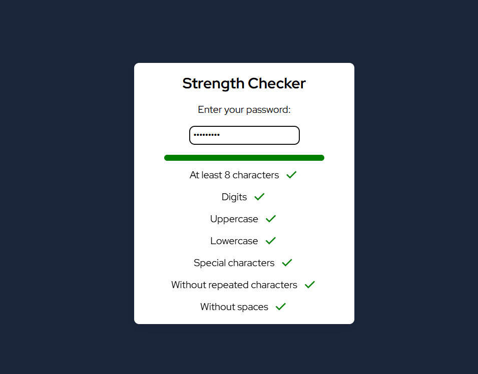

# Password Strength Checker 🔐

A simple password strength checker built with JavaScript, HTML, and CSS.

This project analyzes password strength based on common security criteria and gives visual feedback about what is missing or already correct.

## Features

* Checks minimum length (8 characters)
* Detects digits
* Detects uppercase letters
* Detects lowercase letters
* Detects special characters
* Detects repeated consecutive characters
* Displays strength levels:

  * Zero
  * Too Weak
  * Medium
  * Nice
  * Strong

## Technologies Used

* HTML
* CSS
* JavaScript

## How It Works

The user types a password, and the application evaluates each rule individually.

Each satisfied rule adds strength points, while repeated consecutive characters reduce the score.

A final strength level is shown based on the total score.

## Purpose

This project was created to practice:

* DOM manipulation
* Conditional logic
* Loops
* Regular expressions
* UI feedback

## Preview

Password feedback is displayed instantly with clear validation messages for each requirement.

## Future Improvements
- Sequence detection

* [x] Strength bar visualization

* [x] Real-time validation while typing

## Images & References

<a href='https://pngtree.com/freepng/shiny-blue-heart-love-symbol_8658930.html'>png image from pngtree.com/</a>

[Free Ocean and Clouds Pixel Backgrounds](https://free-game-assets.itch.io/ocean-and-clouds-free-pixel-art-backgrounds)